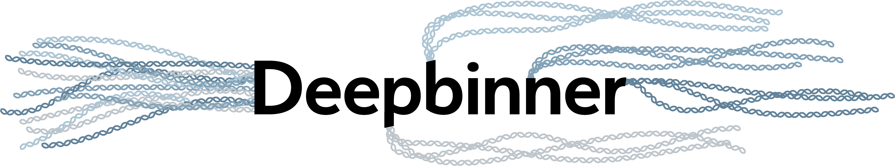

<p align="center"></p>

Deepbinner is a tool for demultiplexing barcoded [Oxford Nanopore](https://nanoporetech.com/) sequencing reads. It does this with a deep [convolutional neural network](https://adeshpande3.github.io/adeshpande3.github.io/A-Beginner's-Guide-To-Understanding-Convolutional-Neural-Networks/) classifier, using many of the [architectural advances](https://towardsdatascience.com/neural-network-architectures-156e5bad51ba) that have proven successful in the field of image classification. Unlike other demultiplexers (e.g. Albacore and [Porechop](https://github.com/rrwick/Porechop)), Deepbinner identifies barcodes from the raw signal (a.k.a. squiggle). This gives it greater sensitivity resulting in fewer unclassified reads. It also allows you to demultiplex raw fast5 files, which is useful if you need to run signal-level analyses (like [Nanopolish](https://github.com/jts/nanopolish)) on your samples.


## Table of contents

  * [Requirements](#requirements)
  * [Installation](#installation)
  * [Quick usage](#quick-usage)
  * [Available trained models](#available-trained-models)
  * [Using Deepbinner after basecalling](#using-deepbinner-after-basecalling)
     * [Step 1: classifying fast5 reads](#step-1-classifying-fast5-reads)
     * [Step 2: binning basecalled reads](#step-2-binning-basecalled-reads)
  * [Using Deepbinner before basecalling](#using-deepbinner-before-basecalling)
  * [Performance](#performance)
  * [Training](#training)
  * [Contributing](#contributing)
  * [License](#license)


## Requirements

Deepbinner runs on MacOS and Linux.


Its most important requirement is [TensorFlow](https://www.tensorflow.org/), which powers its neural network. The easiest way to install it is probably with pip: `pip3 install tensorflow`. However, [building Tensorflow from source](https://www.tensorflow.org/install/install_sources) may [give better performance](https://www.tensorflow.org/performance/performance_guide#optimizing_for_cpu). TensorFlow can also [be built to run on NVIDIA GPUs](https://www.tensorflow.org/install/install_linux#NVIDIARequirements) which can give much better performance, but can be a challenge to install. If you're only going to use Deepbinner to classify reads, then this shouldn't be necessary. But if you want to train your own Deepbinner neural network, then using a GPU is very much recommended.

Deepbinner uses some other Python packages ([Keras](https://keras.io/), [NumPy](http://www.numpy.org/), [h5py](https://www.h5py.org/), [Matplotlib](https://matplotlib.org/) and [noise](https://github.com/caseman/noise)) but these should be taken care of by the Deepbinner installation process. Deepbinner also assumes that you have the `gzip` command available on your command line.


## Installation

### Install from source

Running the `setup.py` script will install a `deepbinner` executable:

```bash
git clone https://github.com/rrwick/Deepbinner.git
cd Deepbinner
python3 setup.py install
deepbinner -h
```

* If the `python3 setup.py install` command complains about permissions, you may need to run it with `sudo`.
* Install just for your user: `python3 setup.py install --user`
    * If you get a strange 'can't combine user with prefix' error, read [this](http://stackoverflow.com/questions/4495120).
* Install to a specific location: `python3 setup.py install --prefix=$HOME/.local`
* Install with pip (local copy): `pip3 install path/to/Deepbinner`
* Install with pip (from GitHub): `pip3 install git+https://github.com/rrwick/Deepbinner.git`


### Run without installation

Deepbinner can be run directly from its repository by using the `deepbinner-runner.py` script, no installation required:

```bash
git clone https://github.com/rrwick/Deepbinner.git
Deepbinner/deepbinner-runner.py -h
```


## Quick usage

__Demultiplex already-basecalled reads:__
```
deepbinner classify -s EXP-NBD103_read_starts -e EXP-NBD103_read_ends fast5_dir > classifications
deepbinner bin --classes classifications --reads basecalled_reads.fastq.gz --out_dir demultiplexed_reads
```

__Demultiplex raw fast5 reads (potentially in real-time during a sequencing run)__:
```
deepbinner realtime --in_dir fast5_dir --out_dir demultiplexed_fast5s -s EXP-NBD103_read_starts -e EXP-NBD103_read_ends
```


## Available trained models

Deepbinner currently only provides pre-trained models for the [EXP-NBD103 native barcoding kit](https://store.nanoporetech.com/native-barcoding-kit-1d.html). These models ([one for the starts of reads](models/EXP-NBD103_read_starts), [one for the ends of reads](models/EXP-NBD103_read_ends)) were trained on native barcoded runs sequenced using the [SQK-LSK108 1D ligation kit](https://store.nanoporetech.com/ligation-sequencing-kit-1d.html) from both R9.4 (a.k.a. FLO-MIN106) and R9.5 (a.k.a. FLO-MIN107) flow cells. If you have similar data, then Deepbinner should work nicely!

If you have different data (e.g. sequenced using the [SQK-RBK004 rapid barcoding kit](https://store.nanoporetech.com/rapid-barcoding-kit.html)), then pre-trained models aren't available. If you have lots of existing data, you can [train your own network](https://github.com/rrwick/Deepbinner/blob/master/training_instructions.md). Alternatively, if you can share your data with me, I could train a model and make it available as part of Deepbinner. [Let me know!](https://github.com/rrwick/Deepbinner/issues)


## Using Deepbinner after basecalling

If your reads are already basecalled, then running Deepbinner is a two-step process:
1. Classify reads using the fast5 files
2. Sort out the basecalled fastq reads using the classifications


### Step 1: classifying fast5 reads

This is accomplished using the `deepbinner classify` command, e.g.:
```
deepbinner classify -s EXP-NBD103_read_starts -e EXP-NBD103_read_ends fast5_dir > classifications
```

Since the native barcoding kit puts barcodes on both the start and end of reads, it makes sense to supply both models to Deepbinner. Most reads should have a barcode at the start, but barcodes at the end are less common. If a read has conflicting barcodes at the start and end, it will be put in the unclassified bin. The `--require_both` option makes Deepbinner only bin reads with a matching start and end barcode, but this is very stringent and will result in far more unclassified reads.

Here is the full usage for `deepbinner classify`:
```
usage: deepbinner classify [-s START_MODEL] [-e END_MODEL] [--scan_size SCAN_SIZE]
                           [--score_diff SCORE_DIFF] [--require_both] [--batch_size BATCH_SIZE]
                           [--verbose] [-h]
                           input

Classify fast5 reads

Positional:
  input                          One of the following: a single fast5 file, a directory of fast5
                                 files (will be searched recursively) or a tab-delimited file of
                                 training data

Models (at least one is required):
  -s START_MODEL, --start_model START_MODEL
                                 Model trained on the starts of reads
  -e END_MODEL, --end_model END_MODEL
                                 Model trained on the ends of reads

Barcoding:
  --scan_size SCAN_SIZE          This much of a read's start/end signal will examined for barcode
                                 signals (default: 6144)
  --score_diff SCORE_DIFF        For a read to be classified, there must be this much difference
                                 between the best and second-best barcode scores (default: 0.5)
  --require_both                 When classifying reads using two models (read start and read end)
                                 require both barcode calls to match to make the final call
                                 (default: False)

Performance:
  --batch_size BATCH_SIZE        Neural network batch size (default: 256)
  --intra_op_parallelism_threads INTRA_OP_PARALLELISM_THREADS
                                 TensorFlow's intra_op_parallelism_threads config option (default:
                                 4)
  --inter_op_parallelism_threads INTER_OP_PARALLELISM_THREADS
                                 TensorFlow's inter_op_parallelism_threads config option (default:
                                 1)
  --device_count DEVICE_COUNT    TensorFlow's device_count config option (default: 1)
  --omp_num_threads OMP_NUM_THREADS
                                 OMP_NUM_THREADS environment variable value (default: 16)

Other:
  --verbose                      Include the output probabilities for all barcodes in the results
                                 (default: just show the final barcode call)
  -h, --help                     Show this help message and exit

```


### Step 2: binning basecalled reads

This is accomplished using the `deepbinner bin` command, e.g.:
```
deepbinner bin --classes classifications --reads basecalled_reads.fastq.gz --out_dir 
```

This will leave your original basecalled reads in place, copying the sequences out to new files in your specified output directory. Both FASTA and FASTQ reads inputs are okay, gzipped or not. Deepbinner will gzip the binned reads at the end of the process.

Here is the full usage for `deepbinner bin`:
```
usage: deepbinner bin --classes CLASSES --reads READS --out_dir OUT_DIR [-h]

Bin fasta/q reads

Required:
  --classes CLASSES  Deepbinner classification file (made with the deepbinner classify command)
  --reads READS      FASTA or FASTQ reads
  --out_dir OUT_DIR  Directory to output binned read files

Other:
  -h, --help         Show this help message and exit
```


## Using Deepbinner before basecalling

If you haven't yet basecalled your reads, you can use `deepbinner realtime` to bin the fast5 files, e.g.:
```
deepbinner realtime --in_dir fast5s --out_dir demultiplexed_fast5s -s EXP-NBD103_read_starts -e EXP-NBD103_read_ends
```

This command will move (not copy) fast5 files from the `--in_dir` directory to the `--out_dir` directory. As the command name suggests, this can be run in real-time - Deepbinner will watch the input directory and wait for new reads. Just set `--in_dir` to where MinKNOW deposits its reads. Or if you sequence on a laptop and copy the reads to a server, you can run Deepbinner on the server, watching the directory where the reads are deposited. Use Ctrl-C to stop it. 

This command doesn't have to be run in real-time - it works just as well on a directory of fast5 files from a finished sequencing run.

Here is the full usage for `deepbinner realtime` (many of the same options as the `classify` command):
```
usage: deepbinner realtime --in_dir IN_DIR --out_dir OUT_DIR [-s START_MODEL] [-e END_MODEL]
                           [--scan_size SCAN_SIZE] [--score_diff SCORE_DIFF] [--require_both]
                           [--batch_size BATCH_SIZE] [-h]

Sort fast5 files during sequencing

Required:
  --in_dir IN_DIR                Directory where sequencer deposits fast5 files
  --out_dir OUT_DIR              Directory to output binned fast5 files

Models (at least one is required):
  -s START_MODEL, --start_model START_MODEL
                                 Model trained on the starts of reads
  -e END_MODEL, --end_model END_MODEL
                                 Model trained on the ends of reads

Barcoding:
  --scan_size SCAN_SIZE          This much of a read's start/end signal will examined for barcode
                                 signals (default: 6144)
  --score_diff SCORE_DIFF        For a read to be classified, there must be this much difference
                                 between the best and second-best barcode scores (default: 0.5)
  --require_both                 When classifying reads using two models (read start and read end)
                                 require both barcode calls to match to make the final call
                                 (default: False)

Performance:
  --batch_size BATCH_SIZE        Neural network batch size (default: 256)
  --intra_op_parallelism_threads INTRA_OP_PARALLELISM_THREADS
                                 TensorFlow's intra_op_parallelism_threads config option (default:
                                 4)
  --inter_op_parallelism_threads INTER_OP_PARALLELISM_THREADS
                                 TensorFlow's inter_op_parallelism_threads config option (default:
                                 1)
  --device_count DEVICE_COUNT    TensorFlow's device_count config option (default: 1)
  --omp_num_threads OMP_NUM_THREADS
                                 OMP_NUM_THREADS environment variable value (default: 16)

Other:
  -h, --help                     Show this help message and exit
```


## Performance

Deepbinner lives up to its name by using a very _deep_ neural network. It's therefore not particularly fast, but should be fast enough to keep up with a MinION run. If you want to squeeze out a bit more performance, try adjusting the 'Performance' options. [Read more here](https://www.tensorflow.org/performance/performance_guide) for a detailed description of these options. In my tests, it can classify about 20 reads/sec using 12 threads (the default). Giving it more threads helps a little, but not much.

Running Deepbinner on a GPU can give much better performance. My tests on a Telsa K80 could classify over 100 reads/sec. Modern GPUs could probably do even better.


## Training

You can train your own neural network with Deepbinner, but you'll need two things:
* Lots of training data using the same barcoding and sequencing kits. More is better, so ideally from more than one sequencing run.
* A fast computer to train on, ideally with [TensorFlow running on a GPU](https://www.tensorflow.org/install/install_linux#NVIDIARequirements).

If you can meet those two requirements, then read on in the [Deepbinner training instructions](https://github.com/rrwick/Deepbinner/blob/master/training_instructions.md)!


## Contributing

As always, the wider community is welcome to contribute to Deepbinner by submitting [issues](https://github.com/rrwick/Deepbinner/issues) or [pull requests](https://github.com/rrwick/Deepbinner/pulls).

However, I have a particular need for one kind of contribution: reads! My lab has mainly used R9.4/R9.5 flowcells with the native barcoding kit. Reads from the rapid barcoding kit (both the older SQK-RBK001 and newer SQK-RBK004) would be very helpful. If you have any, please let me know via email or an [issue](https://github.com/rrwick/Deepbinner/issues). If I could get enough, I'll train a new model and include it in Deepbinner's repo. Since the rapid kit only puts barcodes on the start of the read, I will only need to train a single model, not two (read start and read ends) like I did for native barcoding reads.

A caveat: the reads should be from whole genome sequencing runs of bacterial genomes or larger. I'm concerned that if the reads came from amplicons or small (e.g. viral) genomes, then the neural network might learn to recognise the sequenced material in addition to the barcode - not what we want! Random whole genome sequencing ensures that the sequenced material is mostly different in each read, so the network must learn to recognise the barcodes.


## License

[GNU General Public License, version 3](https://www.gnu.org/licenses/gpl-3.0.html)
